# Toxicity analyzer - Data engineering project

## Front-end

For the front, we chose to do it with VUEJS because it was the technologie we were the most familiar in the team. 
We also use the bootstrap library to help with the design of the app.
Please make sure you have [NodeJS](https://nodejs.org/en/) installed.
For further instructions on how to launch the app, please refer to the ```README.md``` provided in the ```front``` folder.

## Model

We've used the ```original-small``` model version from the [detoxify library](https://pypi.org/project/detoxify/) as it's a lightweight alternative of the ```original``` model which was reported by [the unitary/toxic-bert HuggingFace page](https://huggingface.co/unitary/toxic-bert) to have the best "Detoxify score" and because the assignment stipulated that the text language used must be English.

We've also chosen to build this part of the project as a Flask web server as the assignment also stipulated that the full app's architecture is required to be 3-tier with each layer being respectively the front-end, the back-end and the model.

### Architecture

    |── routes                                                 <- Contains the toxicity analyzer API endpoints
    |   |
    |   |── e2e_route.py                                       <- Route used by the end-to-end tests initializer
    |   |
    |   |── metrics_route.py                                   <- Route targeted by Prometheus's scrapes
    |   |
    |   └── prediction_route.py                                <- Prediction endpoint
    |
    |
    |── services                                               <- Folder containing the services 
    |   |                                                         called by the endpoints
    |   |
    |   ├── constants_service.py                               <- Contains functions to get 
    |   |                                                         the applications's contants
    |   |
    |   ├── extractor_service.py                               <- Proceeds to extract toxicity metrics
    |   |                                                         from the provided user input
    |   |
    |   ├── monitoring.py                                      <- Initializes the application's metrics
    |   |
    |   ├── request_service.py                                 <- Determines the request validity and gets 
    |   |                                                         a conditional error message if needed
    |   |
    |   └── response_service.py                                <- Returns a Flask Response, whether it is a 
    |                                                             message-only or a content response
    |
    |── tests                                                  <- Tests folder
    |   |
    |   ├── back                                               <- Contains files to launch the back-end's
    |   |                                                         integration and stress tests
    |   |
    |   ├── e2e                                                <- Contains the server launch config for
    |   |                                                         end-to-end tests
    |   |
    |   ├── integration                                        <- Integration tests folder
    |   |
    |   ├──  unit                                              <- Unit tests folder
    |   |
    |   ├── BasePredictionEndpointTest.py                      <- Base class used by tests targeting the 
    |   |                                                         prediction endpoint
    |   |
    |   └── ServerThread.py                                    <- Class used to launch the server in a
    |                                                             separate thread
    |
    |── .env                                                   <- Environment file
    |
    |── Dockerfile                                             <- File used to dockerize the model's app
    |
    ├── app.py                                                 <- Mode's application entry point
    |
    ├── poetry.lock                                            <- Poetry file which allows locking the
    |                                                             project to its specific used versions
    |
    └── pyproject.toml                                         <- Poetry file which contains informations
                                                                  about the project
                                                                  and the dependencies it uses

### Installation

After cloning this GitHub repository in your local file system, please make sure you have the following requirements fulfilled on your host machine :

- Python version >= 3.9

- The [Poetry dependency manager](https://python-poetry.org/docs/) command line tool

When everything's in place, run the following command to install the project's dependencies with Poetry :

```
poetry install
```

### Getting started

Before running the application, please make sure you have correctly set the ```FLASK_RUN_HOST```, ```FLASK_RUN_PORT``` and ```FLASK_RUN_APP``` environment variables in the ```.env``` file. By default these are resepctively set to ```0.0.0.0```, 8000 and ```app.py```.

Also, if you want to be able to run the tests targeting the prediction endpoint, please make sure to set the ```PREDICTION_MODEL_HOST``` and ```PREDICTION_MODEL_PORT``` environment variables in which you will have to specify the target host and target port for all requests. By default, these are respectively set to ```127.0.0.1``` and 8000.

To run the application, you have to prefix the ```flask run``` command by poetry run. Example :

```
poetry run flask run
```

Then, you can make requests to the server with the following structure :

```
POST http://<HOST>:<PORT>/predict
```

with the following body structure in JSON format :

```json
{
    "input": "Your input text"
}
```

The server's reponse will be a JSON object containing a response message and a content object displaying the extracted toxicity statistics.

Example :

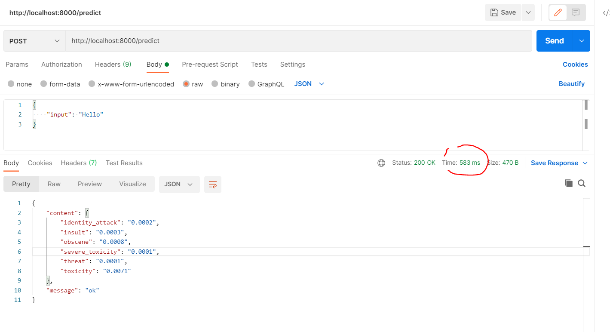

## Back-end

For the back-end, we chose to use Flask as our web API framework because we've already dockerized it in a previous lab and because there are lots of useful Python libraries to process data. Also Flask is relatively easy and adapted for proof of concept projects like this one.

### Architecture

    |── routes                                                 <- Contains the toxicity analyzer API endpoints
    |   |
    |   |── e2e_route.py                                       <- Route used by the end-to-end tests initializer
    |   |
    |   |── metrics_route.py                                   <- Route targeted by Prometheus's scrapes
    |   |
    |   └── analyzer_route.py                                  <- Analyzer endpoint
    |
    |
    |── services                                               <- Folder containing the services 
    |   |                                                         called by the endpoints
    |   |
    |   ├── constants_service.py                               <- Contains functions to get 
    |   |                                                         the applications's contants
    |   |
    |   ├── extractor_service.py                               <- Proceeds to extract toxicity metrics
    |   |                                                         from the provided user input
    |   |
    |   ├── monitoring.py                                      <- Initializes the application's metrics
    |   |
    |   ├── request_service.py                                 <- Determines the request validity and gets 
    |   |                                                         a conditional error message if needed
    |   |
    |   └── response_service.py                                <- Returns a Flask Response, whether it is a 
    |                                                             message-only or a content response
    |
    |── tests                                                  <- Tests folder
    |   |
    |   ├── e2e                                                <- Contains the server launch config for
    |   |                                                         end-to-end tests
    |   |
    |   ├── integration                                        <- Integration tests folder
    |   |
    |   ├──  unit                                              <- Unit tests folder
    |   |
    |   ├── BaseAnalyzerEndpointTest.py                        <- Base class used by tests targeting the 
    |   |                                                         analyzer endpoint
    |   |
    |   └── ServerThread.py                                    <- Class used to launch the server in a
    |                                                             separate thread
    |
    |── .env                                                   <- Environment file
    |
    |── Dockerfile                                             <- File used to dockerize the model's app
    |
    ├── app.py                                                 <- Mode's application entry point
    |
    ├── poetry.lock                                            <- Poetry file which allows locking the
    |                                                             project to its specific used versions
    |
    └── pyproject.toml                                         <- Poetry file which contains informations
                                                                  about the project
                                                                  and the dependencies it uses

### Installation

After cloning this GitHub repository in your local file system, please make sure you have the following requirements fulfilled on your host machine :

- Python version >= 3.9

- The [Poetry dependency manager](https://python-poetry.org/docs/) command line tool

When everything's in place, run the following command to install the project's dependencies with Poetry :

```
poetry install
```

### Getting started

Before running the application, please make sure you have correctly set the ```FLASK_RUN_HOST```, ```FLASK_RUN_PORT```, ```FLASK_RUN_APP```, ```PREDICTION_MODEL_HOST``` and ```PREDICTION_MODEL_PORT``` environment variables in the ```.env``` file. By default these are resepctively set to ```0.0.0.0```, 5000, ```app.py```, ```127.0.0.1``` and 8000.

Also, if you want to be able to run the tests targeting the analyzer endpoint, please make sure to set the ```ANALYZER_MODEL_HOST``` and ```ANALYZER_MODEL_PORT``` environment variables in which you will have to specify the target host and target port for all requests. By default, these are respectively set to ```127.0.0.1``` and 5000.

To run the application, you have to prefix the ```flask run``` command by poetry run. Example :

```
poetry run flask run
```

Then, you can make requests to the server with the following structure :

```
POST http://<HOST>:<PORT>/analyzer
```

with the following body structure in JSON format :

```json
{
    "input": "Your input text"
}
```

The server's reponse will be a JSON object containing a response message and a content object displaying the extracted toxicity statistics.

Example :

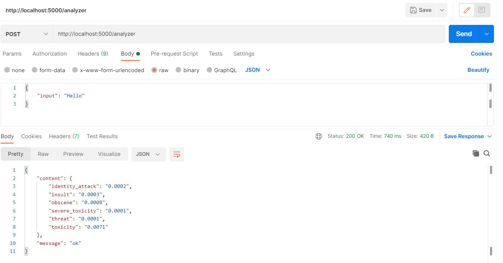

### Tests

- Unit tests and stress tests have been implemented on the model and back-end applications. 

- End-to-end tests have been implemented on the front-end application. 

- Integration tests are implemented on all applications.

#### *Unit tests* :

To launch unit tests, you have to navigate to the root of the model or back-end application and run this command :

```
poetry run python -m pytest ./tests/unit
```

#### *Integration tests* :

- Model application : to launch the model app integration tests, you have to navigate to the root of the model application and run this command :

```
poetry run python -m pytest ./tests/integration
```

**These do not require you to start the model server before** as everything's already set up via the ```conftest.py``` file which contains a pytest fixture that starts the model server in a new thread before the integration tests session begins and shuts it down after the session ends.

- Back-end application : as most of its integration tests also target the model server and as we could not figure a way to start it beforehand from the back application, we chose to launch back-end integration tests from the model app instead. Therefore, to launch the back-end app integration tests, you have to navigate to the root of the model application and run this command :

```
poetry run python -m pytest ./tests/back/launch_back_integration_tests.py
```

**These do not require you to start any server before** as launching this command will automatically invoke the ```conftest.py``` fixture which will start the model server and launch a command line instruction which will invoke the back-end app's integration tests which will also automatically invoke their pytest fixture.

- Front-end application : to launch the front-end app integration tests, you have to check first if your local host satisfies [the Cypress library's required dependencies](https://docs.cypress.io/guides/continuous-integration/introduction#Dependencies). Then, you have to navigate to the root of the model application and make sure you have installed the packages listed in the ```package.json``` file by running :

```
npm install
```

After that, you can proceed to launch the front-end integration tests by running

```
npm run cy:integration:run
```

This will run tests without starting the Cypress UI browser (headless mode). **This does not require you to start the front-end server before** as it will automatically be launched by the ```start-server-and-test``` module in the script command. Front-end integration tests do not target the back-end or the model application. However, if you wish to run them visually, you can open the Cypress browser by running :

```
npm run cy:open
```

You will then be able to select whichever test you want to run, however, you will need to start the front-end server beforehand as nothing will be automatically setup if you choose this graphical option.

#### *Stress tests* :

- Model application : to launch the model app stress tests, you have to navigate to the root of the model application and run this command :

```
poetry run python -m pytest ./tests/stress
```

**These do not require you to start the model server before** as everything's already set up via the ```conftest.py``` file which contains a pytest fixture that starts the model server in a new thread before the stress tests session begins and shuts it down after the session ends. The ```tests/stress/test_stress.py``` file contains tests which check if the model server is able to meet the assignment requirement of 100 requests per second, which corresponds to a response time of 600 ms at most.

- Back-end application : as all of its stress tests also target the model server and as we could not figure a way to start it beforehand from the back application, we chose to launch back-end stress tests from the model app instead (as we previously explained in the integration tests part). Therefore, to launch the back-end app stress tests, you have to navigate to the root of the model application and run this command :

```
poetry run python -m pytest ./tests/back/launch_back_stress_tests.py
```

**These do not require you to start any server before** as launching this command will automatically invoke the ```conftest.py``` fixture which will start the model server and launch a command line instruction which will invoke the back-end app's stress tests which will also automatically invoke their pytest fixture.

#### *Locust stress tests* :

For both back-end and model apps, we've also chosen to run stress tests with [the Locust library](https://locust.io/) which provided us with nice graphical vizualizations during our load tests.

To launch the model's stress tests with Locust without the graphical interface, just run this command at the root of the model app :

```
poetry run locust --config ./tests/stress/locust.conf
```

Once again, **this does not require you to launch the model server beforehand** as everything will automatically be handled in the ```locustfile.py``` file.

However, if you wish to run them graphically, you'll have to start the model server beforehand manually and then run at the root of the model folder :

```
poetry run locust -f ./tests/stress/locustfile.py -H 127.0.0.1:8000 --web-port 9000
```

This command will launch the Locust test server on port 9000 and will provide you with a nice web interface in which metrics and graphs will be accessible and updated in real time while stress tests are ran via Locust :

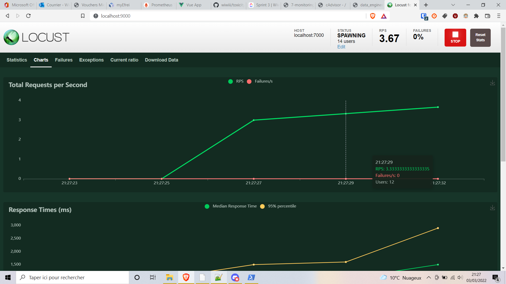

#### *End-to-end (e2e) tests* :

To launch the front-end app end-to-end tests, you have to check first if your local host satisfies [the Cypress library's required dependencies](https://docs.cypress.io/guides/continuous-integration/introduction#Dependencies). Then, you have to navigate to the root of the model application and make sure you have installed the packages listed in the ```package.json``` file by running :

```
npm install
```

After that, you can proceed to launch the front-end end-to-end tests by running

```
npm run cy:e2e:run
```

This will run tests without starting the Cypress UI browser (headless mode). **This does not require you to start any server before** as everything will automatically be launched by the ```start-server-and-test``` module in the script command which recursively calls similar scripts to set up the back-end and model server beforehand. However, if you wish to run them visually, you can open the Cypress browser by running :

```
npm run cy:open
```

You will then be able to select whichever test you want to run, however, you will need to start the front-end, back-end and model servers beforehand as nothing will be automatically setup if you choose this graphical option.

## Virtualization 

We've used Docker to virtualize each part of our application as we are been taught during the Data Engineering course and as it recommended in the project statement.

As you can see in architecture, we've set up a dockerfile in each application folder

**Front docker file configuration**
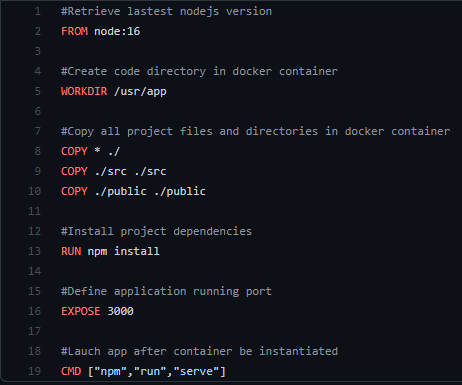

**Back docker file configuration**
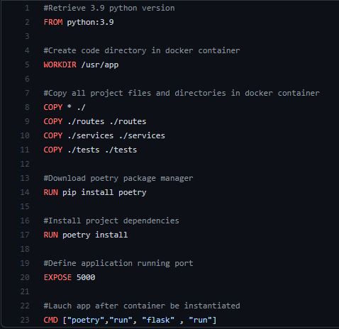

**Model docker file configuration**
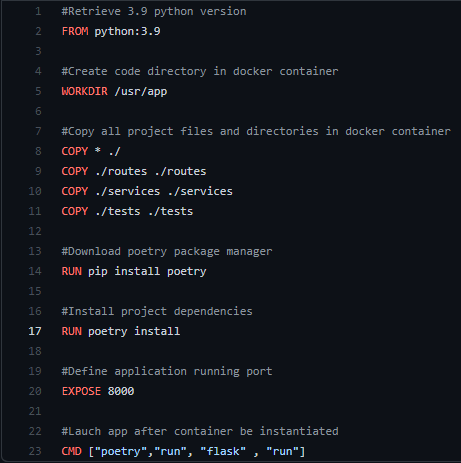

## Automation

For the automation part, we've used Jenkins where we set a multibranch pipeline to manage workflow depending on the branch. 

**Multibranch pipeline set up**

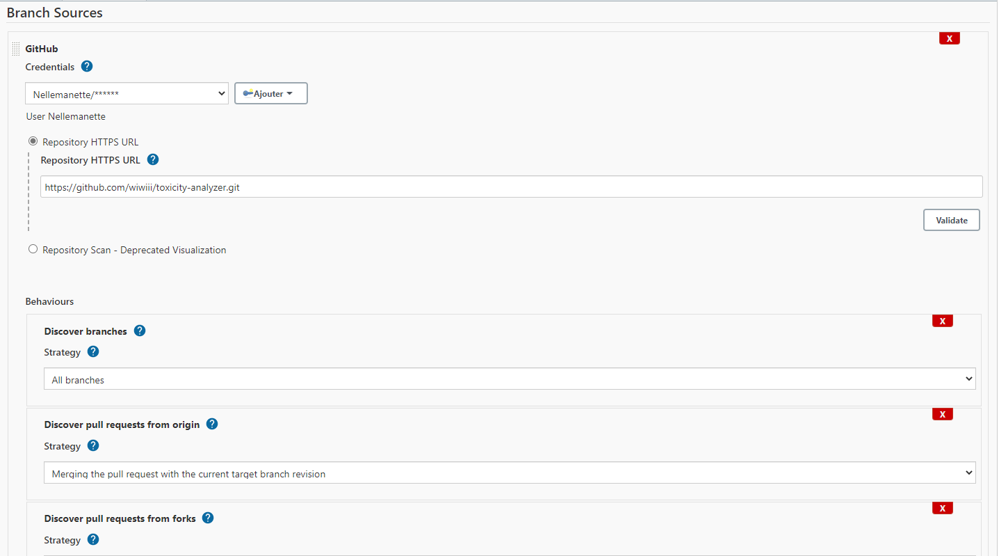
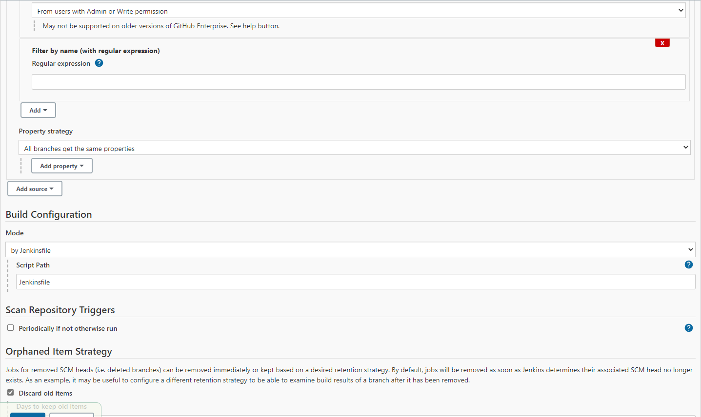
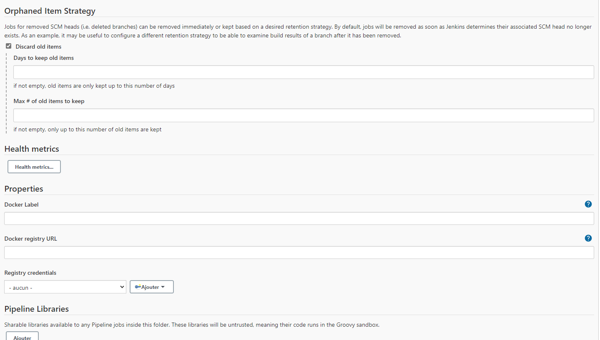

**Multibranch pipeline script**

We've set a unique and single pipeline in which we've used the ``when`` directive to specify on which pushed branch the pipeline have to run.

*Exemple*
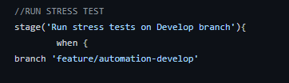

**Workflow description**

On each type branch we have a specific pipeline steps running
If a developer push changes to a feature branch the following workflow will run:

*feature branch pipeline*

We've run unit tests in back and model application with ``pytest``.
If they're succeed, there will be a **feature** branch merge into **develop** branch

*develop branch pipeline*

We've run stress tests in model application with ``pytest`` or ``locust``.
If they're succeed, there will be a **develop** branch merge into **release** branch

*release branch pipeline*

We've run integration tests in model application with ``pytest``.
We've also run end-to-end tests in front application with ``npm``
If they're succeed, there will be a **release** branch merge into **master** branch

*master branch pipeline*

We've build docker images for front/back/model application
if it's succeed, We've pushed each docker image to the docker-hub repository corresponding.

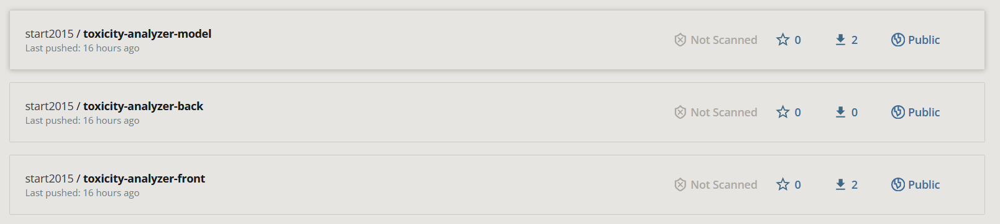

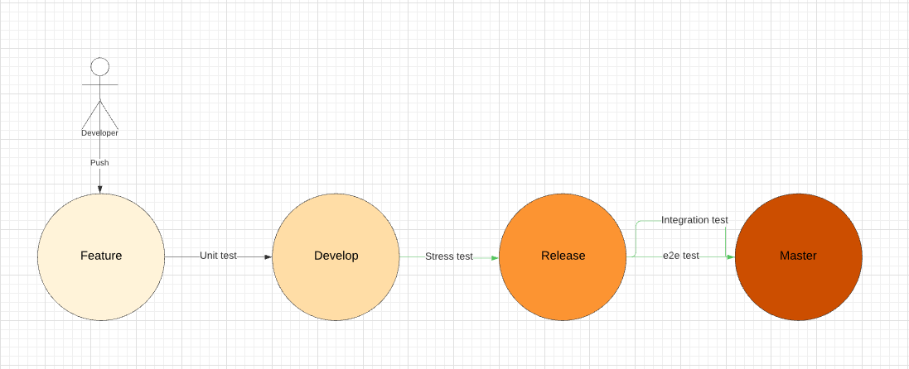

Jenkins tool have also been deployed on AWS to run pipelines faster and usable by all team member

## Monitoring


### *Metrics*


Monitoring has been implemented on all applications. We've used Grafana as mentioned in the assignment as the monitoring dashboard. For each, the following metrics are available :

- Total requests counter

- Metrics endpoint request counter

- Exception counter

- Time spent processing requests summary

- In-progress requests counter gauge

- Last served request timestamp gauge

- Request latency summary

- Request latency histogram

- Hardware metrics via Node Exporter and the metrics endpoints

Each application exposes a ```/metrics``` endpoint to allow Prometheus's scrapes.

The back-end and model apps both use the [prometheus-client library](https://pypi.org/project/prometheus-client/).

As the front-end is a Vue.js app, we had to implement a metrics server by ourselves using the [NodeJS prom-client library](https://www.npmjs.com/package/prom-client) by adding an Express server which is started concurrently with the front-end server when the app is launched. To be able to redirect Prometheus's scrapes to the front-end monitoring server, we added a proxy setting to the Vue.js devServer in the ```vue.config.js``` file like this :

```js
devServer: {
    proxy: {
      '/metrics': {
        target: `http://${config.DEV_SERVER_HOST}:${config.MONITORING_SERVER_PORT}`
      }
    }
  }
```

### *Alerts*

We chose to use the [Discord AlertManager Prometheus integration](https://hub.docker.com/r/benjojo/alertmanager-discord/) Docker image alongside with our dockerized monitoring infrastructure to be able to receive alerts via a Discord bot on a separate server like this :

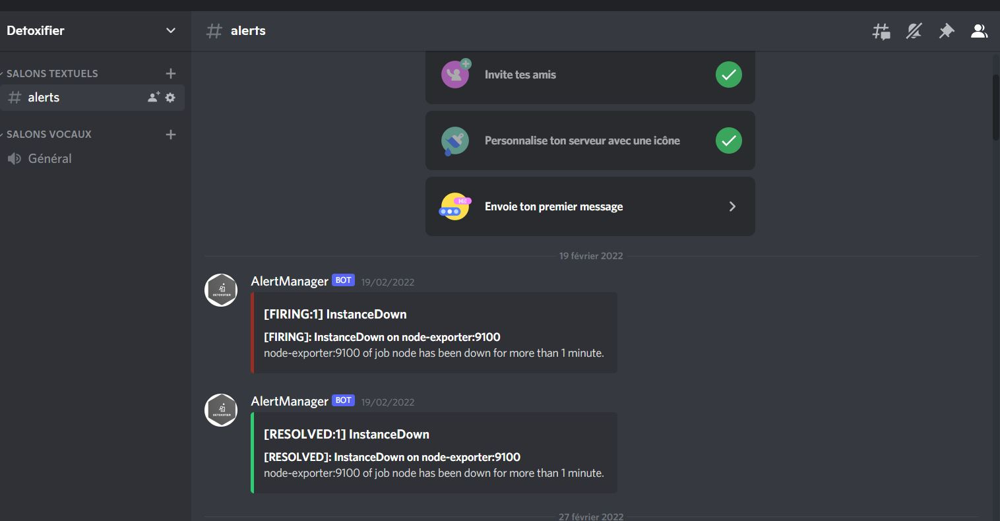

The following alerts have been implemented :

- Instance down

- Application host almost out of memory

- Application host CPU heavy load


## AWS Jenkins server setup

We've used a ```t2.small``` EC2 instance after creating its security group (similar to a set of firewall rules for inbound and outbound traffic). Its AMI (Amazon Machine Image, similar to a Docker image) is an Ubuntu 20.04 LTS.

We've firstly installed Jenkins by running this set of commands (if it doesn't work, run this script twice) :

```
wget -q -O - https://pkg.jenkins.io/debian/jenkins.io.key | sudo apt-key add - && \
sudo sh -c 'echo deb http://pkg.jenkins.io/debian-stable binary/ > /etc/apt/sources.list.d/jenkins.list' && \
sudo apt update && \
sudo apt install default-jre jenkins --yes && \
sudo systemctl enable jenkins && \
sudo systemctl start jenkins && \
sudo cat /var/lib/jenkins/secrets/initialAdminPassword
```

Then we've installed Docker from the official convenience script and we added jenkins to the docker user group to enable Docker commands from Jenkins :

```
sudo curl -sSL https://get.docker.com/ | sh && \
docker --version && \
sudo usermod -aG docker $USER && \
sudo usermod -aG docker jenkins
```

Then we've installed docker-compose :

```
sudo curl -L "https://github.com/docker/compose/releases/download/1.29.2/docker-compose-$(uname -s)-$(uname -m)" -o /usr/local/bin/docker-compose && \
sudo chmod +x /usr/local/bin/docker-compose && \
sudo ln -s /usr/local/bin/docker-compose /usr/bin/docker-compose && \
docker-compose --version
```

Then we've installed NodeJS and npm :

```
sudo apt-get install nodejs --yes && \
sudo apt-get install npm --yes && \
nodejs --version && \
npm --version
```

As our app required Python >= 3.9 and the existing Python version was 3.8, we've also installed Python 3.9 :

```
sudo apt-get install python3.9 --yes
```

Then, to give an alias to the python command, we've updated the ```~/.bashrc``` file by adding these lines at the end of the file :

```
alias python='/bin/python3.9'
alias python3='/bin/python3.9'
```

Afterwards, we've refreshed this file by running :

```
source $HOME/.bashrc
```

And we checked Python's version :

```
python --version && \
python3 --version
```

We installed the Poetry package manager :

```
curl -sSL https://raw.githubusercontent.com/python-poetry/poetry/master/get-poetry.py | python3 - && \
source $HOME/.poetry/env && \
source $HOME/.bashrc && \
poetry --version
```

We installed dependencies to be able to run Cypress tests :

```
sudo apt-get install libgtk2.0-0 libgtk-3-0 libgbm-dev libnotify-dev libgconf-2-4 libnss3 libxss1 libasound2 libxtst6 xauth xvfb --yes
```

We allowed everything on the ```/home``` directory to allow Jenkins to run commands from the ```/home/bin``` folder (quick and dirty solution) :

```
sudo chmod -R 777 /home
```

We added Jenkins to the sudoers to allow it to run sudo commands :

```
sudo visudo
```

At the end of the open file, we added this line :

```
jenkins ALL=(ALL) NOPASSWD: ALL
```

Then we restarted Jenkins by going to http://<jenkins_url>/restart

Afterwards, everything that was left was mostly to configure credentials and build our pipeline.

## Contributors

@CarineTalandier
@Nellemanette
@wiwiii
